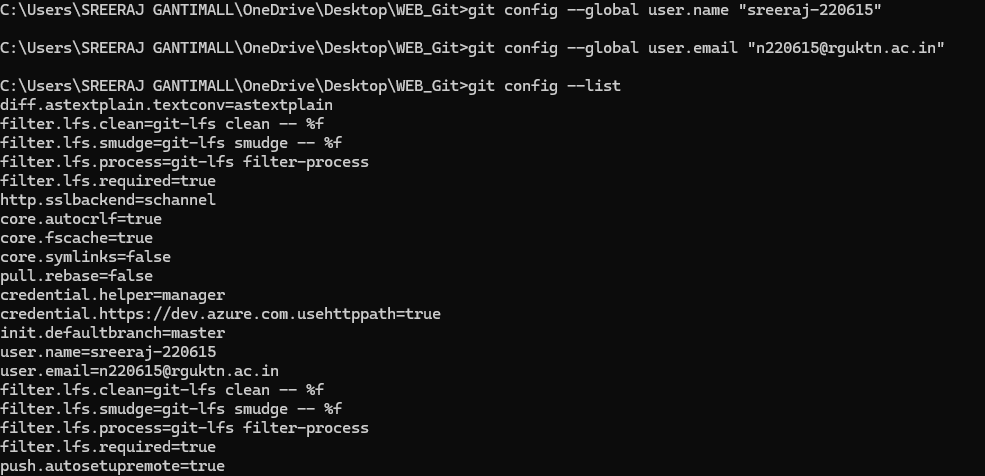

# Git Industry Commands Documentation
Author: sreeraj-220615

====================================================

1. git config --global user.name
Syntax:
git config --global user.name "sreeraj-220615"

Purpose:
Sets the global Git username used for commits.

Example:
git config --global user.name "sreeraj-220615"

Screenshot:

----------------------------------------------------

2. git config --global user.email
Syntax:
git config --global user.email "n220615@rguktn.ac.in"

Purpose:
Sets the global Git email used for commits.

Example:
git config --global user.email "n220615@rguktn.ac.in"

Screenshot:

----------------------------------------------------

3. git config --list
Syntax:
git config --list

Purpose:
Displays all Git configuration settings.

Example:
git config --list

Screenshot:

----------------------------------------------------

4. git config --unset
Syntax:
git config --unset <key>

Purpose:
Removes a configuration entry.

Example:
git config --global --unset user.name

Screenshot:

----------------------------------------------------

5. git init
Syntax:
git init

Purpose:
Initializes a new Git repository.

Example:
git init

Screenshot:

----------------------------------------------------

6. git clone
Syntax:
git clone <repository-url>

Purpose:
Copies a remote repository.

Example:
git clone https://github.com/sreeraj-220615/sample-project.git

Screenshot:

----------------------------------------------------

7. git clone --branch
Syntax:
git clone --branch <branch-name> <repository-url>

Purpose:
Clones a specific branch.

Example:
git clone --branch main https://github.com/sreeraj-220615/sample-project.git

Screenshot:

----------------------------------------------------

8. git clone --depth
Syntax:
git clone --depth 1 <repository-url>

Purpose:
Creates a shallow clone.

Example:
git clone --depth 1 https://github.com/sreeraj-220615/sample-project.git

Screenshot:

----------------------------------------------------

9. git status
Syntax:
git status

Purpose:
Shows repository status.

Example:
git status

Screenshot:

----------------------------------------------------

10. git log
Syntax:
git log

Purpose:
Shows commit history.

Example:
git log

Screenshot:

----------------------------------------------------

11. git log --oneline
Syntax:
git log --oneline

Purpose:
Shows commit history in one line.

Example:
git log --oneline

Screenshot:

----------------------------------------------------

12. git log --graph
Syntax:
git log --graph --oneline

Purpose:
Displays commit graph.

Example:
git log --graph --oneline

Screenshot:

----------------------------------------------------

13. git show
Syntax:
git show HEAD

Purpose:
Displays details of the latest commit.

Example:
git show HEAD

Screenshot:

----------------------------------------------------

14. git diff
Syntax:
git diff

Purpose:
Shows file differences.

Example:
git diff

Screenshot:

----------------------------------------------------

15. git diff --staged
Syntax:
git diff --staged

Purpose:
Shows staged differences.

Example:
git diff --staged

Screenshot:

----------------------------------------------------

16. git blame
Syntax:
git blame <file>

Purpose:
Shows author for each line.

Example:
git blame README.md

Screenshot:

----------------------------------------------------

17. git reflog
Syntax:
git reflog

Purpose:
Shows reference log.

Example:
git reflog

Screenshot:

----------------------------------------------------

18. git shortlog
Syntax:
git shortlog

Purpose:
Summarizes commits by author.

Example:
git shortlog

Screenshot:

----------------------------------------------------

19. git add
Syntax:
git add <file>

Purpose:
Adds file to staging area.

Example:
git add file1.txt

Screenshot:

----------------------------------------------------

20. git add .
Syntax:
git add .

Purpose:
Adds all files.

Example:
git add .

Screenshot:

----------------------------------------------------

21. git add -A
Syntax:
git add -A

Purpose:
Adds all changes.

Example:
git add -A

Screenshot:

----------------------------------------------------

22. git restore
Syntax:
git restore <file>

Purpose:
Restores file changes.

Example:
git restore file1.txt

Screenshot:

----------------------------------------------------

23. git restore --staged
Syntax:
git restore --staged <file>

Purpose:
Unstages a file.

Example:
git restore --staged file1.txt

Screenshot:

----------------------------------------------------

24. git rm
Syntax:
git rm <file>

Purpose:
Deletes file.

Example:
git rm oldfile.txt

Screenshot:

----------------------------------------------------

25. git mv
Syntax:
git mv old.txt new.txt

Purpose:
Renames file.

Example:
git mv old.txt new.txt

Screenshot:

----------------------------------------------------

26. git commit
Syntax:
git commit

Purpose:
Records changes.

Example:
git commit

Screenshot:

----------------------------------------------------

27. git commit -m
Syntax:
git commit -m "message"

Purpose:
Commit with message.

Example:
git commit -m "Initial commit"

Screenshot:

----------------------------------------------------

28. git commit --amend
Syntax:
git commit --amend

Purpose:
Modify last commit.

Example:
git commit --amend

Screenshot:

----------------------------------------------------

29. git branch
Example:
git branch

Screenshot:

----------------------------------------------------

30. git branch -a
Example:
git branch -a

Screenshot:

----------------------------------------------------

31. git branch -d
Example:
git branch -d feature

Screenshot:

----------------------------------------------------

32. git branch -D
Example:
git branch -D feature

Screenshot:

----------------------------------------------------

33. git checkout
Example:
git checkout main

Screenshot:

----------------------------------------------------

34. git checkout -b
Example:
git checkout -b new-feature

Screenshot:

----------------------------------------------------

35. git switch
Example:
git switch main

Screenshot:

----------------------------------------------------

36. git switch -c
Example:
git switch -c dev

Screenshot:

----------------------------------------------------

37. git merge
Example:
git merge feature

Screenshot:

----------------------------------------------------

38. git merge --no-ff
Example:
git merge --no-ff feature

Screenshot:

----------------------------------------------------

39. git remote
Example:
git remote

Screenshot:

----------------------------------------------------

40. git remote -v
Example:
git remote -v

Screenshot:

----------------------------------------------------

41. git remote add
Example:
git remote add origin https://github.com/sreeraj-220615/project.git

Screenshot:

----------------------------------------------------

42. git remote remove
Example:
git remote remove origin

Screenshot:

----------------------------------------------------

43. git fetch
Example:
git fetch

Screenshot:

----------------------------------------------------

44. git fetch --all
Example:
git fetch --all

Screenshot:

----------------------------------------------------

45. git pull
Example:
git pull

Screenshot:

----------------------------------------------------

46. git pull --rebase
Example:
git pull --rebase

Screenshot:

----------------------------------------------------

47. git push
Example:
git push

Screenshot:

----------------------------------------------------

48. git push -u origin main
Example:
git push -u origin main

Screenshot:

----------------------------------------------------

49. git push --force
Example:
git push --force

Screenshot:

----------------------------------------------------

50. git stash
Example:
git stash

Screenshot:

----------------------------------------------------

51. git stash list

Screenshot:

----------------------------------------------------

52. git stash pop

Screenshot:

----------------------------------------------------

53. git stash apply

Screenshot:

----------------------------------------------------

54. git stash drop

Screenshot:

----------------------------------------------------

55. git stash clear

Screenshot:

----------------------------------------------------

56. git reset
Example:
git reset HEAD

Screenshot:

----------------------------------------------------

57. git reset --soft
Example:
git reset --soft HEAD~1

Screenshot:

----------------------------------------------------

58. git reset --mixed
Example:
git reset --mixed HEAD~1

Screenshot:

----------------------------------------------------

59. git reset --hard
Example:
git reset --hard HEAD~1

Screenshot:

----------------------------------------------------

60. git revert
Example:
git revert HEAD

Screenshot:

----------------------------------------------------

61. git clean -f

Screenshot:

----------------------------------------------------

62. git clean -fd

Screenshot:

----------------------------------------------------

63. git rebase
Example:
git rebase main

Screenshot:

----------------------------------------------------

64. git rebase -i

Screenshot:

----------------------------------------------------

65. git rebase --continue

Screenshot:

----------------------------------------------------

66. git rebase --abort

Screenshot:

----------------------------------------------------

67. git cherry-pick
Example:
git cherry-pick commit-id

Screenshot:

----------------------------------------------------

68. git format-patch

Screenshot:

----------------------------------------------------

69. git apply

Screenshot:

----------------------------------------------------

70. git tag
Example:
git tag

Screenshot:

----------------------------------------------------

71. git tag -a
Example:
git tag -a v1.0 -m "version 1.0"

Screenshot:

----------------------------------------------------

72. git tag -d

Screenshot:

----------------------------------------------------

73. git push --tags

Screenshot:

----------------------------------------------------

74. git submodule add

Screenshot:

----------------------------------------------------

75. git bisect

Screenshot:

----------------------------------------------------